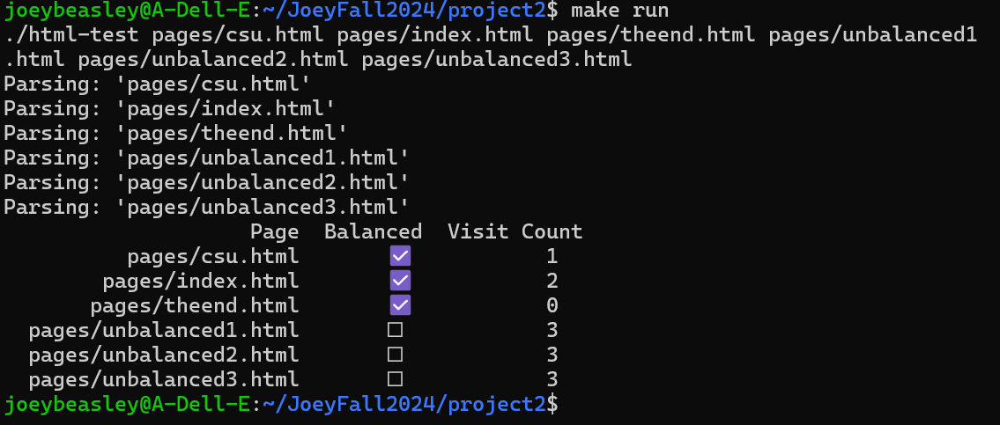
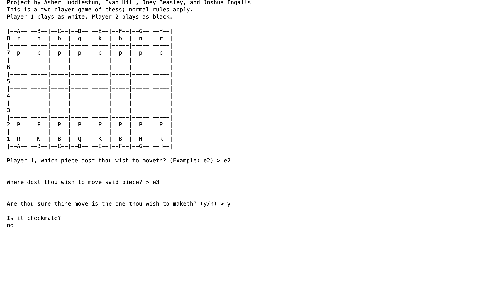
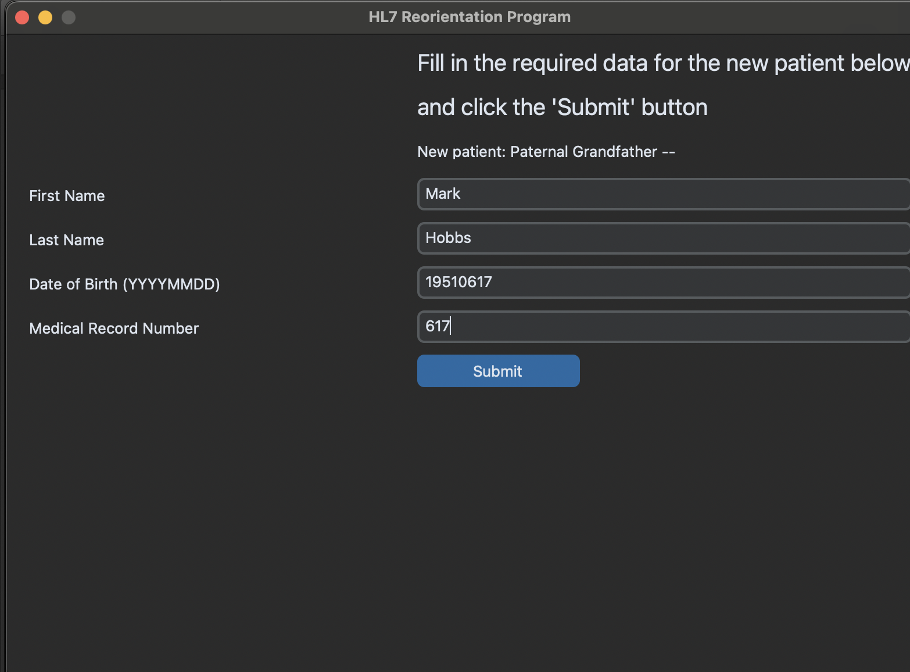
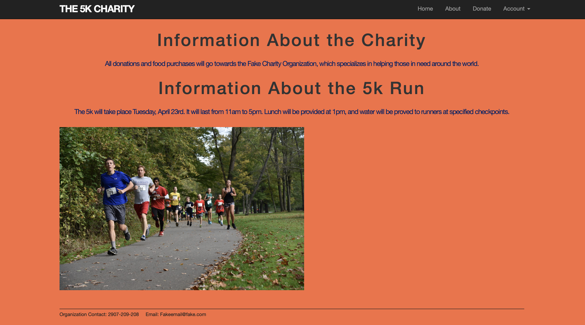

Portfolio
=========

Programming Projects
--------------------

*For access to my private project repositories, please [email me](mailto:jwbeasley@csustudent.net?subject=GitHub%20Access) with the subject line, GitHub Access.

---
### [Senior Project | CSCI 499](seniorproject)

---
### [Project 1 Title | CSCI 301](project1)

---
### [Project 2 Title | CSCI 315](project2)

---
### [Project 3 Title | CSCI 325](project3)

---
### [Project 4 Title | CSCI 332](project4)

---

Ethics Papers
-------------

### [Ethic Paper | CSCI 315](EthicsPaper1)

-   **Class:** CSCI 315
-   **Grade:** 98

### [Ethic Paper | CSCI 325](EthicsPaper2)

-   **Class:** CSCI 325
-   **Grade:** A

### [Copyrights and Wrongs | CSCI 305](EthicsPaper3)

-   **Class:** 305 
-   **Grade:** A

---

Presentations
-------------

### [The Sony Hack of 2024](pdf/SonyHackof2014.pdf)

- **Class:** CSCI 405
- **Grade:** A

### [Now This is Leak Cinema](pdf/NowThisisLeakCinema.pdf)

- **Class:** CSCI 405
- **Grade:** A

---

Page template forked from <a href="https://github.com/csu-cs/csci-portfolio">CSU-CS</a>

<!-- Remove above link if you don't want to attributive -->
