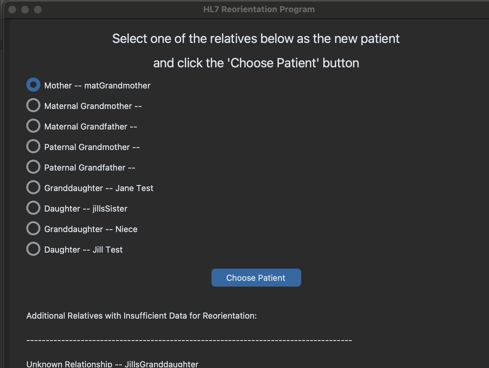
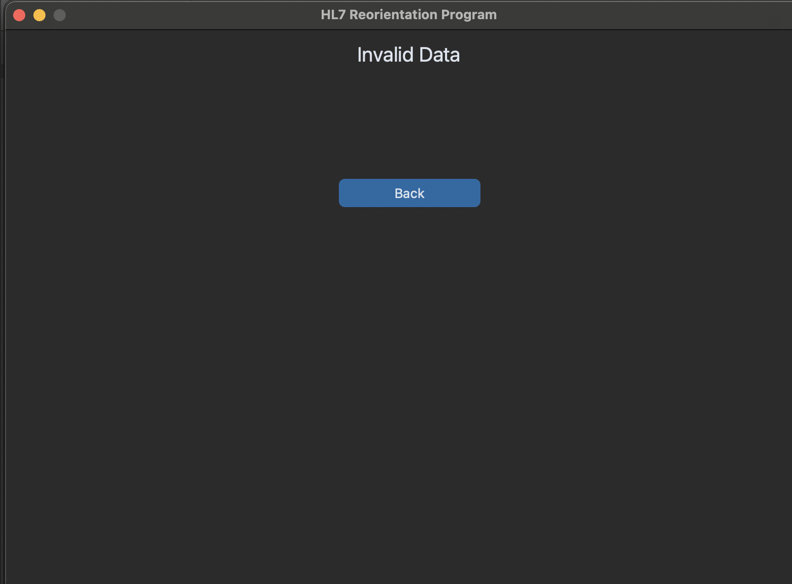

[Back to Portfolio](./)

Project 3: Pedigree
===============

-   **Class:** CSCI 495
-   **Grade:** 80
-   **Language(s):** Python
-   **Source Code Repository:** [features/mastering-markdown]([https://guides.github.com/features/mastering-markdown/]
    (Please [email me](mailto:JWBeasley@csustudent.net?subject=GitHub%20Access) to request access.)

## Project description

This was made to check and track the medical records of a family. As a team, we had to code connections betweeen members
(Mother,Father,Son,Uncle,Grandmother, etc) to a system, along with the individual family member's name and history.

## How to compile and run the program

How to compile (if applicable) and run the project.

Download the zip file and then open the HL7 Reorientation Program file. From there, open one of the tree files and select the family member from the list. Once selected, enter their info.
## UI Design

Make run would run the code. Make example-test runs the example test file.

  
Fig 1. The launch screen

  
Fig 2. Opening a file

  
Fig 3. Selecting a member

  
Fig 4. Entering a family member's info

  
Fig 5. Feedback when an error occurs.

[Back to Portfolio](./)
