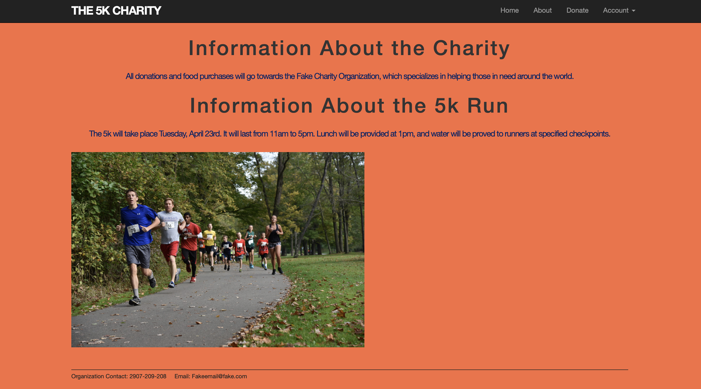

[Back to Portfolio](./)

Project 4: Ruby on Rails
===============

-   **Class:** CSCI 334
-   **Grade:** A
-   **Language(s):** Ruby on Rails
-   **Source Code Repository:** [features/mastering-markdown]([https://guides.github.com/features/mastering-markdown/]
    (Please [email me](mailto:JWBeasley@csustudent.net?subject=GitHub%20Access) to request access.)

## Project description

This was a team project to test user interface design and web design. We worked off a template to include information for a race
and an option for users to register by sending their email through a text box. It would also keep track of who has
entered and whether or not their email was already listed.

## How to compile and run the program

How to compile (if applicable) and run the project.

## UI Design

  
Fig 1. The launch screen

  
Fig 2. The log-in page.

  
Fig 3. After logging in successfully

## 3. Additional Considerations

For more details see [GitHub Flavored Markdown](https://guides.github.com/features/mastering-markdown/).

[Back to Portfolio](./)
