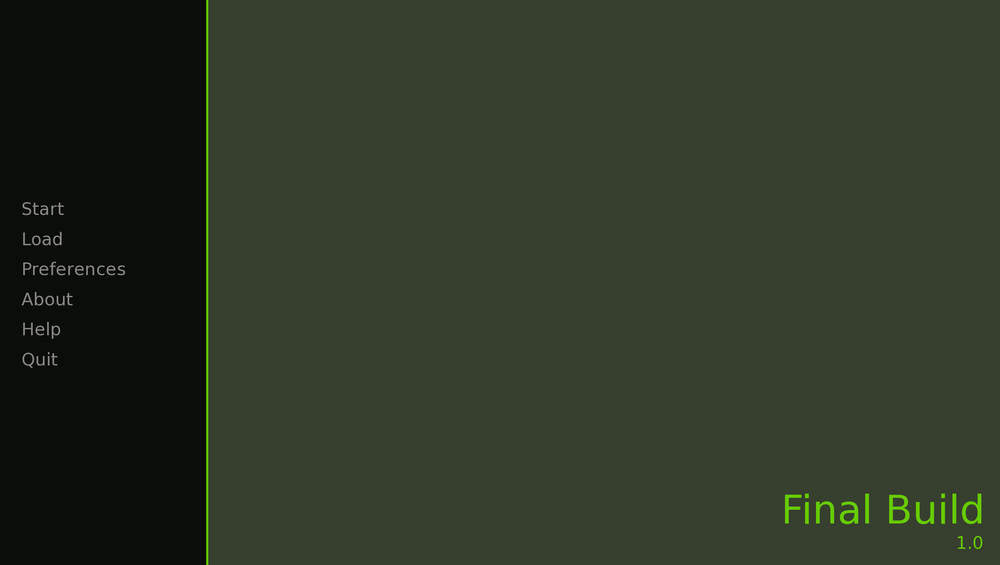
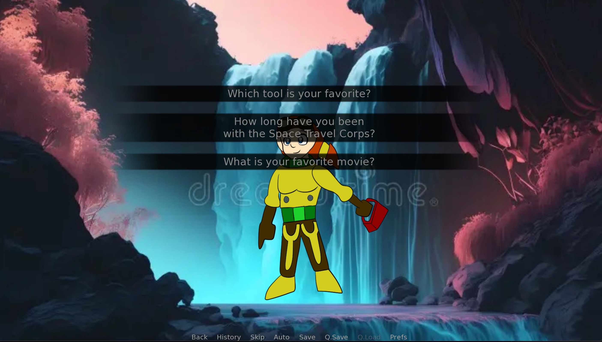
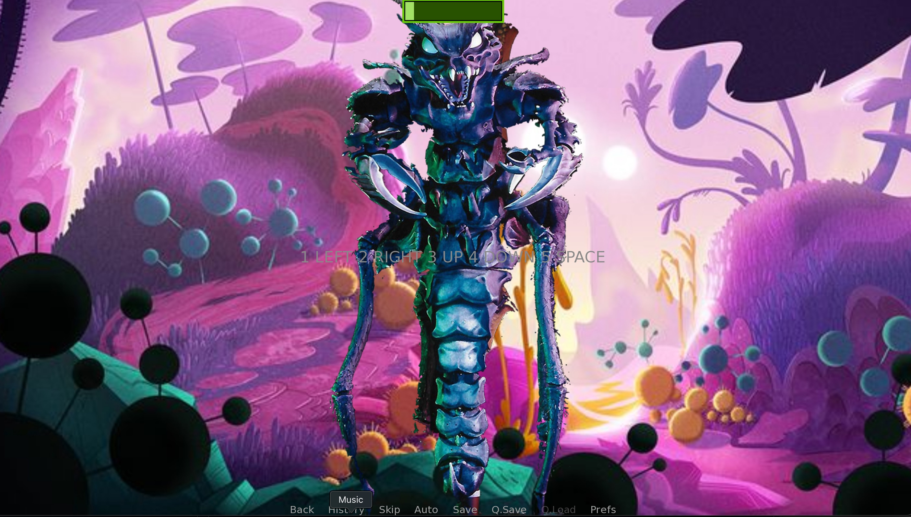
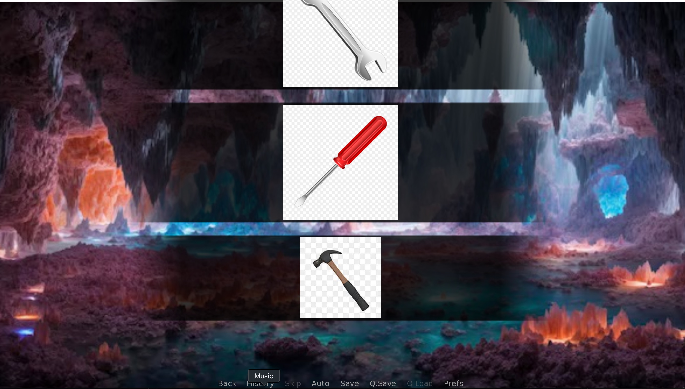

[Back to Portfolio](./)

Senior Project
===============

-   **Class:** CSCI 315
-   **Grade:** 
-   **Language(s):** Python
-   **Source Code Repository:** [features/mastering-markdown]([https://github.com/JoeyBeasley/JoeySP])  
    (Please [email me](mailto:JWBeasley@csustudent.net?subject=GitHub%20Access) to request access.)

## Project description

TestPlanBeasley.pdf

## How to compile and run the program

How to compile (if applicable) and run the project.

Open the file in Renpy and select "Launch Project"

## UI Design

Make run would run the code. Make example-test runs the example test file.

  
Fig 1. The launch screen

  
Fig 2. EOffering if you want the mechanic to ask a question, or for you to ask her a question. This comes in handy later when a shapeshifting alien poses as her.

  
Fig 3. Players must press the spacebar to shoot an alien before it attacks their team.

  
Fig 4. The correct tool must be selected from a prompt describing what needs to be fixed on the ship.

## 3. Additional Considerations

For more details see [GitHub Flavored Markdown](https://guides.github.com/features/mastering-markdown/).

[Back to Portfolio](./)
